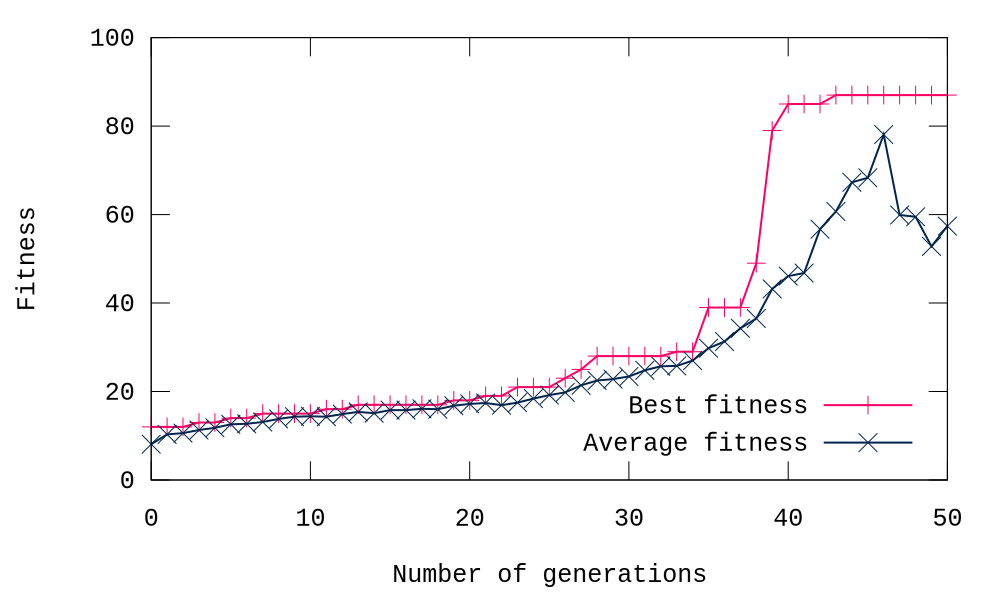

## Evolving objects overview

program is run: **python3 evolution.py**

There are four main criteria for evaluation: **efficiency**, **illuminance uniformity**, **glare reduction** and **light pollution**

user can set program parameters and evaluation criteria in file **parameters.json**

### Examples
There are examples for each criterion:

#### Used parameters
{
    "lamp": {
        "number_of_rays": 20,
	"ray_distribution": "uniform",
        "base_length": 200,
        "base_angle": 15,
        "angle_lower_bound": 90,
        "angle_upper_bound": 180,
        "length_lower_bound": 1,
        "length_upper_bound": 3
        },
    "road": {
        "start": -1000,
        "end": 10000, 
	"depth": -8000,
	"sections": 4
    },
    "evolution": {
        "population_size": 10,
        "number_of_generations": 100,
        "operators": {
            "mutation": {
                "angle_mutation_prob": 0.4,
                "length_mutation_prob": 0.4
            },
            "xover_prob": 0
        }
    },
    "evaluation": {
	"reflective_factor" : 0.98,
	"inverse_square_law": "No",
	"cosine_error": "No",
        "criterion": "efficiency"
    }
}

#### Glare reduction

